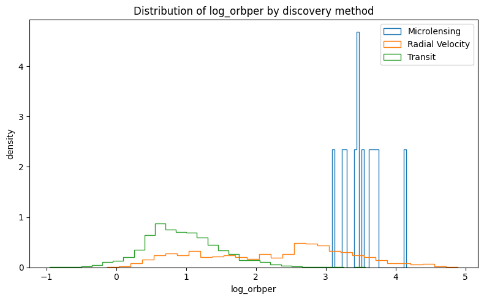
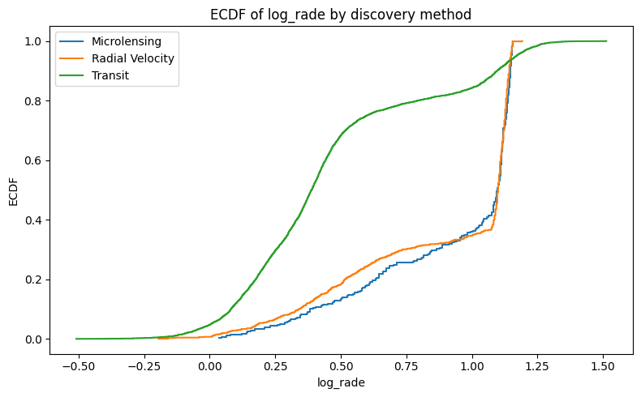
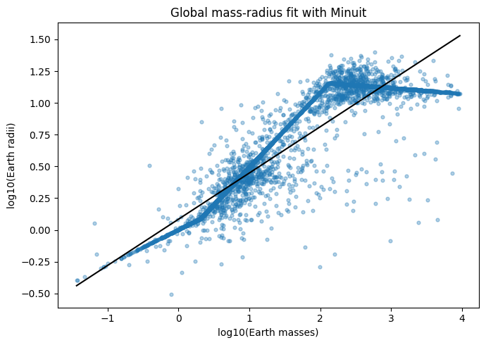
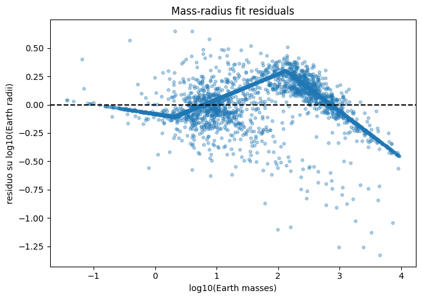
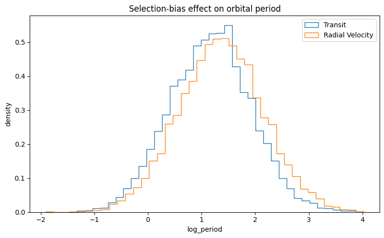

# Exoplanet Discovery Biases

Statistical analysis of observational biases in exoplanet discovery methods using data from the NASA Exoplanet Archive.

The project compares observed distributions of orbital period, planetary radius, and planetary mass across discovery methods such as Transit, Radial Velocity, and Microlensing. It also includes a simple log-log mass-radius fit and a lightweight Monte Carlo simulation to illustrate how selection effects can reshape an underlying planet population into different observed samples.

## Key Takeaways

- Discovery method is treated as an observational selection variable, not just as a label.
- The analysis compares observed distributions with descriptive plots, non-parametric tests, and binned independence tests.
- The mass-radius fit provides a compact baseline model, while residuals and method-specific summaries show where a global fit is too simple.
- The Monte Carlo section is a qualitative demonstration of selection bias, not a full physical population model.

## Repository Structure

```text
.
+-- CITATION.cff
+-- LICENSE
+-- executed-on-2026-05-28/
|   +-- exoplanet_detection_bias_analysis_executed.html
|   +-- exoplanet_detection_bias_analysis_executed.ipynb
|   +-- exoplanet_detection_bias_analysis_executed.pdf
+-- figures/
|   +-- distribution_log_orbital_period_by_method.png
|   +-- ecdf_log_radius_by_method.png
|   +-- mass_radius_fit.png
|   +-- mass_radius_residuals.png
|   +-- monte_carlo_selection_bias_period.png
+-- notebooks/
|   +-- exoplanet_detection_bias_analysis.ipynb     # Main English notebook
|   +-- exoplanet_detection_bias_analysis_it.ipynb  # Italian version
+-- requirements.txt
+-- README.md
```

## Data Source

The notebooks download data directly from the `pscomppars` table of the NASA Exoplanet Archive TAP service:

<https://exoplanetarchive.ipac.caltech.edu/>

No catalog data are committed to this repository. Since the archive is updated over time, exact counts, fitted values, and p-values may change when the notebooks are rerun.

## Analysis Outline

1. Download selected planet and host-star columns from the NASA Exoplanet Archive.
2. Clean duplicate entries, invalid physical values, and missing numeric fields.
3. Select discovery methods with enough planets for statistical comparison.
4. Compare observed distributions with histograms, boxplots, ECDFs, KS tests, and chi-square tests.
5. Fit a simple mass-radius relation in log space using `iminuit`.
6. Use bootstrap resampling to estimate uncertainty on selected summary statistics.
7. Simulate qualitative detection biases with a Monte Carlo toy model.

## Getting Started

Recommended Python version: **Python 3.11 or 3.12**.

Create a virtual environment and install the dependencies:

```bash
python -m venv .venv
source .venv/bin/activate  # Windows PowerShell: .venv\Scripts\Activate.ps1
pip install -r requirements.txt
```

Then start Jupyter and open the English notebook:

```bash
jupyter notebook notebooks/exoplanet_detection_bias_analysis.ipynb
```

For a non-editable-style example with outputs and conclusions from one completed run, open `executed-on-2026-05-28/exoplanet_detection_bias_analysis_executed.ipynb`.

The same executed run is also available as HTML and PDF in `executed-on-2026-05-28/`.

## Executed Snapshot

The `executed-on-2026-05-28/` directory contains a dated snapshot of one completed analysis run:

- [exoplanet_detection_bias_analysis_executed.ipynb](executed-on-2026-05-28/exoplanet_detection_bias_analysis_executed.ipynb): executed notebook with outputs and run-specific conclusions.
- [exoplanet_detection_bias_analysis_executed.html](executed-on-2026-05-28/exoplanet_detection_bias_analysis_executed.html): browser-friendly rendered version.
- [exoplanet_detection_bias_analysis_executed.pdf](executed-on-2026-05-28/exoplanet_detection_bias_analysis_executed.pdf): fixed report-style export.

Keeping these files separate from `notebooks/` makes the repository easier to navigate: `notebooks/` contains reusable source notebooks, while `executed-on-2026-05-28/` contains a frozen example generated from the live NASA Exoplanet Archive data available on that date.

## Figures

Selected figures from the executed notebook are exported in `figures/` for quick inspection.

### Orbital Period by Discovery Method



### Radius ECDF by Discovery Method



### Global Mass-Radius Fit



### Mass-Radius Residuals



### Monte Carlo Selection Bias Example



## Reproducibility Notes

- The notebooks are stored without executed outputs so Git diffs stay readable.
- The executed notebook is kept separately as a reproducible example snapshot.
- Random simulations and bootstrap examples use fixed seeds where relevant.
- Internet access is required to download the current NASA Exoplanet Archive data.
- The analysis is descriptive and catalog-based; it should not be interpreted as an unbiased inference of the intrinsic exoplanet population.

## License

This project is released under the MIT License. See `LICENSE` for details.

## Citation

If you use or adapt this project, cite it using the metadata in `CITATION.cff`.
